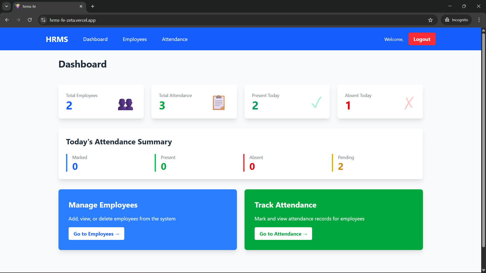
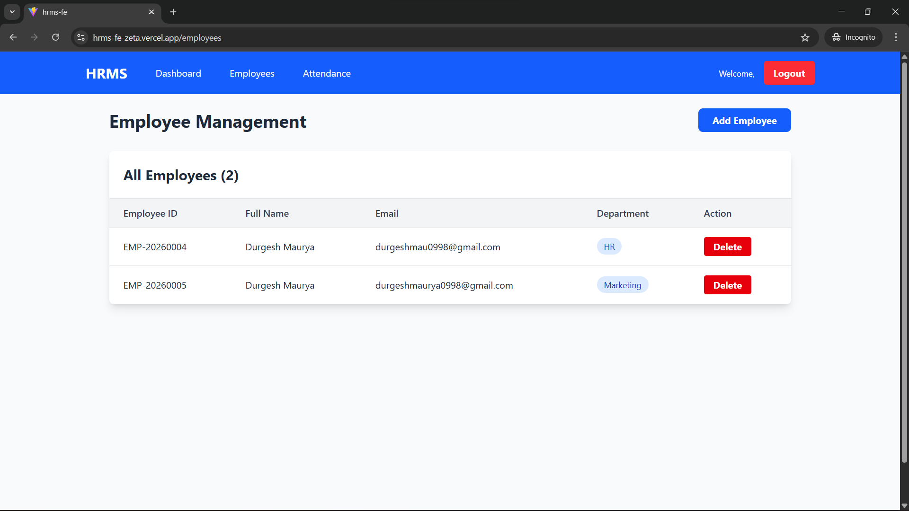
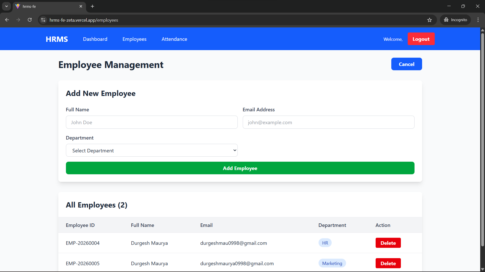
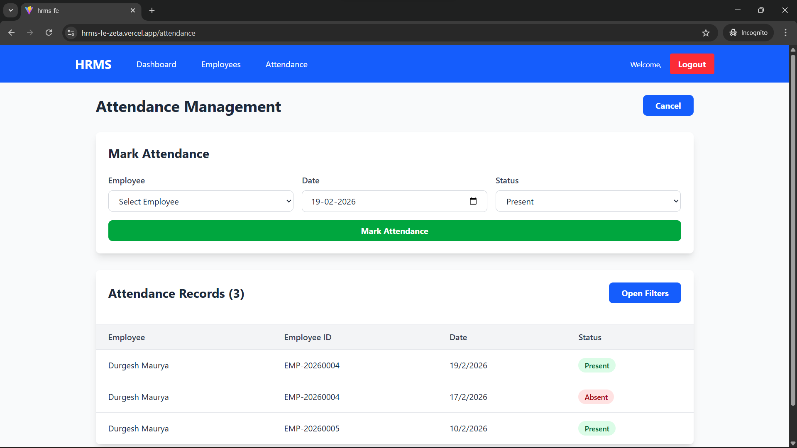
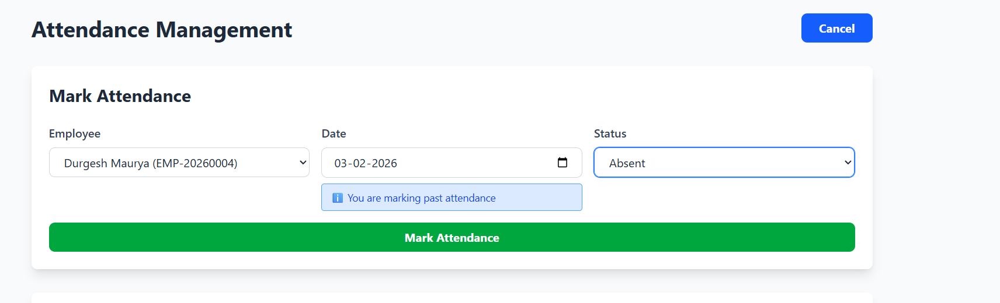
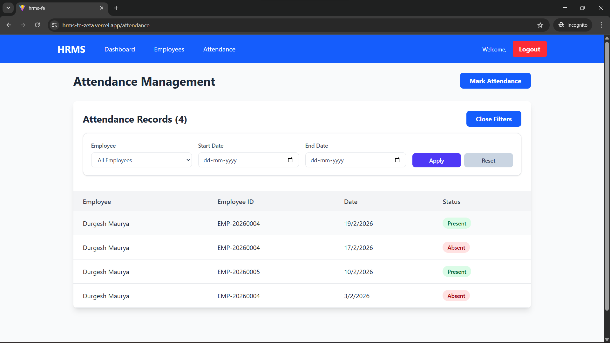

# HRMS Frontend - Human Resource Management System

## Project Overview

The HRMS Frontend is a modern React-based web application for managing human resources efficiently. It provides comprehensive features for employee management, attendance tracking, and dashboard analytics. The application enables HR administrators to:

- **Manage Employees**: Add, view, and delete employee records
- **Track Attendance**: Mark attendance, view records, and filter by date range and employee
- **Dashboard Analytics**: View real-time statistics including total employees, attendance counts, and today's attendance summary
- **User Authentication**: Secure login/logout system with token-based authentication

# Demo Credentials:
 - Email: admin@example.com
 - Password: password123


# Login Page


# Dashboard


# Employee 


## Add Employee


# Attendance


## Mark Attendance



## Add Filter - Date & Employee Wise



### Key Features

-  Employee Management (CRUD operations)
-  Attendance Tracking with date range filtering
-  Real-time Dashboard with statistics
-  Formik-based form validation
-  Responsive UI with Tailwind CSS
-  API integration with error handling
-  Past attendance marking indicator
-  Login/Logout functionality

---

## Tech Stack

### Frontend Framework & Libraries
- **React 18.x** - UI library for building interactive components
- **React Router DOM** - Client-side routing and navigation
- **Redux Toolkit** - State management for auth and loader states
- **Formik** - Form state management and validation
- **Axios** - HTTP client for API requests

### Styling & UI
- **Tailwind CSS** - Utility-first CSS framework for styling
- **CSS Modules** - Component-scoped styling

### Build Tools
- **Vite** - Fast build tool and dev server
- **ESLint** - Code linting and quality

### Development Environment
- **Node.js** - JavaScript runtime
- **npm** - Package manager

---

## Installation & Setup

### Prerequisites
- Node.js (v14 or higher)
- npm (v6 or higher)
- Git
- Backend API running locally

### Steps to Run Locally

1. **Clone the repository**
   ```bash
   git clone <repository-url>
   cd hrms-fe
   ```

2. **Install dependencies**
   ```bash
   npm install
   ```

3. **Configure environment variables**
   Create a `.env` file in the root directory:
   ```env
   VITE_API_BASE_URL=http://localhost:8080/api/v1
   VITE_APP_NAME=HRMS
   ```

4. **Start the development server**
   ```bash
   npm run dev
   ```
   The application will be available at `http://localhost:5173`

5. **Build for production**
   ```bash
   npm run build
   ```

6. **Preview production build**
   ```bash
   npm run preview
   ```

---

## Project Structure

```
hrms-fe/
├── src/
│   ├── components/
│   │   ├── AttendanceManagement.jsx
│   │   ├── EmployeeManagement.jsx
│   │   └── Login.jsx
│   ├── pages/
│   │   ├── Attendance.jsx
│   │   ├── Dashboard.jsx
│   │   └── Employees.jsx
│   ├── Layout/
│   │   ├── Layout.jsx
│   │   └── NavBar.jsx
│   ├── redux/
│   │   ├── Store.js
│   │   ├── reducer/
│   │   │   ├── auth.slice.js
│   │   │   ├── loader.slice.js
│   │   │   └── index.reducer.js
│   ├── services/
│   │   ├── apiConnector.js
│   │   ├── apis.js
│   │   └── operations/
│   │       ├── authAPI.js
│   │       ├── dashboardAPI.js
│   │       ├── userAPI.js
│   │       ├── employeeAPI.js
│   │       └── attendanceAPI.js
│   ├── utils/
│   │   └── toast.js
│   ├── App.jsx
│   ├── main.jsx
│   ├── index.css
│   ├── ProtectedRoute.jsx
│   └── PublicRoute.jsx
├── public/
├── package.json
├── vite.config.js
├── tailwind.config.js
├── eslint.config.js
└── README.md
```

---

## API Endpoints Integration

### Employee Endpoints
- `GET /employee/all` - Fetch all employees
- `POST /employee/add` - Add new employee
- `DELETE /employee/delete/:id` - Delete employee

### Attendance Endpoints
- `POST /attendance/mark` - Mark attendance
- `GET /attendance` - Get all attendance records
- `GET /attendance/:employeeId` - Get employee attendance
- `GET /attendance/filter/by-date` - Filter attendance by date range (query params: startDate, endDate, employeeId)
- `GET /attendance/:employeeId/today` - Get today's attendance for an employee
- `DELETE /attendance/:id` - Delete attendance record

### Dashboard Endpoints
- `GET /employee/dashboard` - Get dashboard statistics (total employees, attendance counts, today's summary)

### Authentication Endpoints
- `POST /auth/login` - User login
- `POST /auth/logout` - User logout
- `POST /auth/verify-token` - Verify access token

---

## Features in Detail

### 1. Employee Management
- Add new employees with name, email, and department
- View all employees in a table format
- Delete employees with confirmation
- Form validation using Formik
- Backend auto-generates employee ID

### 2. Attendance Tracking
- Mark attendance for employees with date and status (Present/Absent)
- Indicator for marking past attendance
- Advanced filtering by:
  - Employee name/ID (single filter)
  - Date range with start and end dates (single filter)
  - Combined filters (employee + date range)
  - Reset to view all records
- End date validation (cannot be before start date)
- View all attendance records in table format
- Display dates in DD/MM/YYYY format (Indian locale)

### 3. Dashboard
- Real-time statistics:
  - Total employees count
  - Total attendance records count
  - Present count (all time)
  - Absent count (all time)
- Today's attendance summary:
  - Records marked today
  - Employees present today
  - Employees absent today
  - Pending attendance records

### 4. Authentication
- Secure login form
- Token-based authentication (JWT)
- Logout functionality
- Protected routes for authenticated users
- Public routes for login page
- Session management

---

## Assumptions & Limitations

### Assumptions
1. **Backend API is running** at `http://localhost:8080/api/v1` (configurable via `.env` file)
2. **User authentication** is handled via JWT tokens stored in browser storage
3. **Employee ID is auto-generated** by the backend (frontend does not send ID during creation)
4. **Attendance records are fetched and filtered** based on employee ID and date range
5. **User has valid session** before accessing protected routes
6. **Email validation** follows standard email format (no complex regex validation)
7. **Date format from backend** is ISO 8601 (YYYY-MM-DD)
8. **User is logged in** to access Dashboard, Employees, and Attendance pages
9. **Only authenticated users** can view employee and attendance data
10. **Logout clears authentication state** and redirects to login page

### Limitations
1. **No real-time updates** - Requires page refresh or manual API call to see latest data from other users
2. **No bulk operations** - Employees and attendance must be managed one at a time
3. **No export functionality** - Cannot export attendance or employee data to CSV/Excel format
4. **No edit functionality** - Employee records cannot be updated; must delete and re-add with new information
5. **No advanced filtering** - Only basic employee ID and date range filters available; no department or status filters
6. **No role-based access control (RBAC)** - All authenticated users have the same permissions and access
7. **No offline support** - Application requires active internet connection; no offline data caching
8. **Limited search functionality** - Must scroll through all records or use filters; no global search bar
9. **Client-side validation only** - Only basic form validation; relies on backend for comprehensive validation
10. **Single user session** - No multi-user dashboard view or shared workspaces; one login per browser
11. **No notification system** - No push notifications or in-app alerts for important events
12. **No audit logs** - No tracking of who made what changes, when, and why
13. **No attendance approval workflow** - All attendance records are auto-marked without approval process
14. **Date picker limited** - Cannot block specific dates or mark holidays
15. **No performance metrics** - No dashboard for employee performance or productivity tracking

---

## Dependencies

### Main Dependencies
- `react` (v18.x) - UI library
- `formik` - Form state management and validation
- `axios` - HTTP client
- `redux` & `@reduxjs/toolkit` - State management
- `react-router-dom` - Client-side routing
- `tailwindcss` - CSS framework
- `react-redux` - Redux React bindings

For complete dependency list, see `package.json`

---

## Environment Variables

Create a `.env` file in the root directory:

```env
VITE_API_BASE_URL=http://localhost:8080/api/v1
VITE_APP_NAME=HRMS
```

---

## Running the Application

### Development Mode
```bash
npm run dev
```
Starts the Vite dev server with hot module reloading at `http://localhost:5173`

### Production Build
```bash
npm run build
```
Creates an optimized production build in the `dist/` folder

### Preview Build
```bash
npm run preview
```
Serves the production build locally for testing

### Linting
```bash
npm run lint
```
Runs ESLint to check for code quality issues

---

## Troubleshooting

### Common Issues & Solutions

1. **API Connection Error**
   - Ensure backend server is running on `http://localhost:8080`
   - Check network connectivity and firewall settings
   - Verify `.env` configuration for correct API base URL

2. **Login Issues / 401 Unauthorized**
   - Clear browser cookies, session storage, and local storage
   - Check backend authentication service is running
   - Verify user credentials are correct
   - Check if JWT token is expired

3. **Attendance Filter Not Working**
   - Ensure start date is before or equal to end date
   - Check if employees exist in the system
   - Verify date format matches YYYY-MM-DD
   - Try resetting filters to view all records

4. **Page Refresh Issues / Logged Out After Refresh**
   - Check if user session/token is still valid
   - Re-login if session expired
   - Clear browser cache and check localStorage for token
   - Verify backend token validation

5. **Employees/Attendance Data Not Loading**
   - Check network tab in browser DevTools for API errors
   - Verify backend API is returning data in expected format
   - Check browser console for error messages
   - Try refreshing the page

---

## Performance Optimization

-  Lazy loading of components (React Router code splitting)
-  Memoization of callbacks with useCallback
-  Efficient state management with Redux for global state
-  Optimized API calls with proper error handling
-  Tailwind CSS for minimal CSS bundle
-  Vite for fast development and production builds

---

## Future Enhancements

- [ ] Employee profile editing functionality
- [ ] Bulk attendance marking for multiple employees
- [ ] Data export to CSV/Excel format
- [ ] Real-time data synchronization with WebSocket
- [ ] Advanced reporting and analytics dashboard
- [ ] Role-based access control (RBAC)
- [ ] Attendance approval workflow
- [ ] Email notifications for HR events
- [ ] Mobile-responsive improvements
- [ ] Dark mode support
- [ ] Offline support with data caching
- [ ] Holiday/leave management
- [ ] Payroll integration

---

## Contact & Support

For issues, questions, or contributions, please:
- Create an issue in the repository
- Contact the development team
- Check existing documentation

---

## License

This project is proprietary and confidential. All rights reserved.

---

**Last Updated**: February 19, 2026
**Version**: 1.0.0
